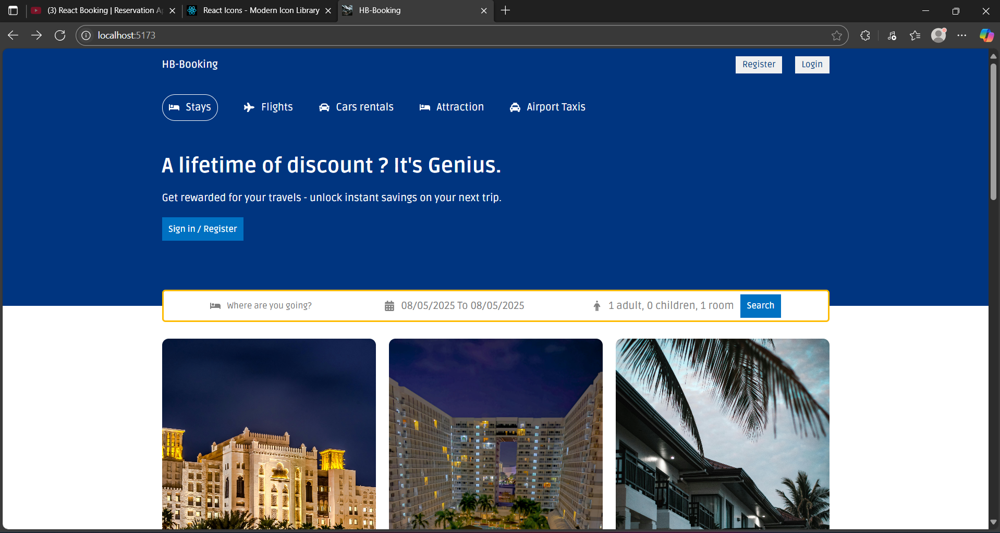
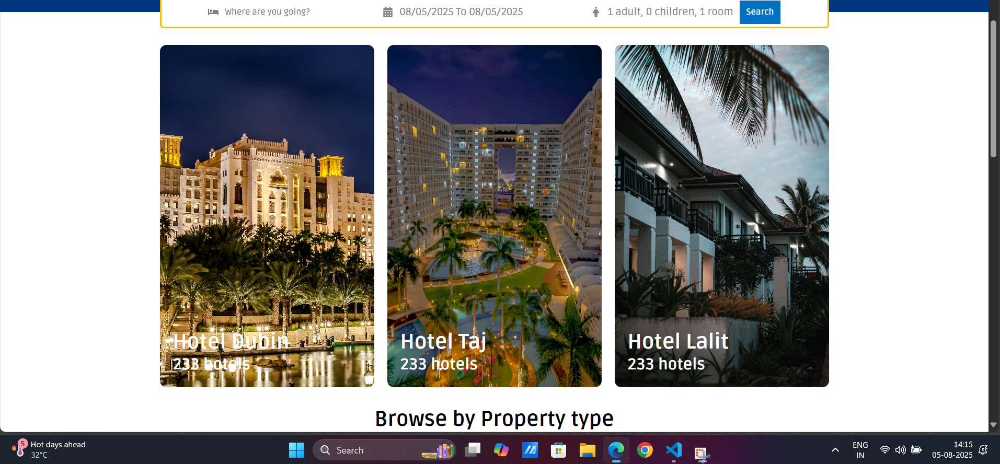
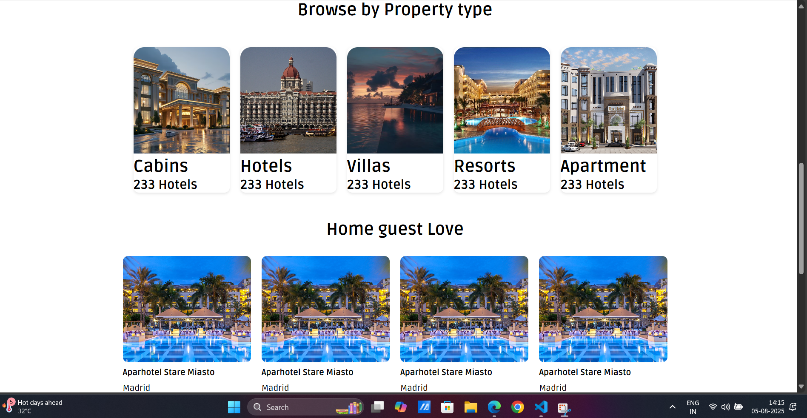
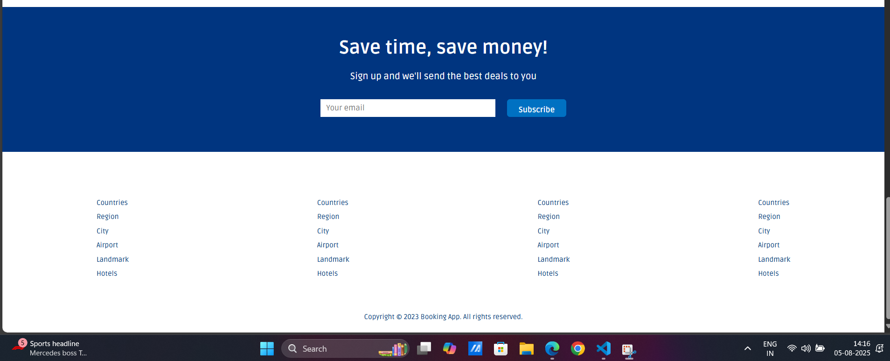
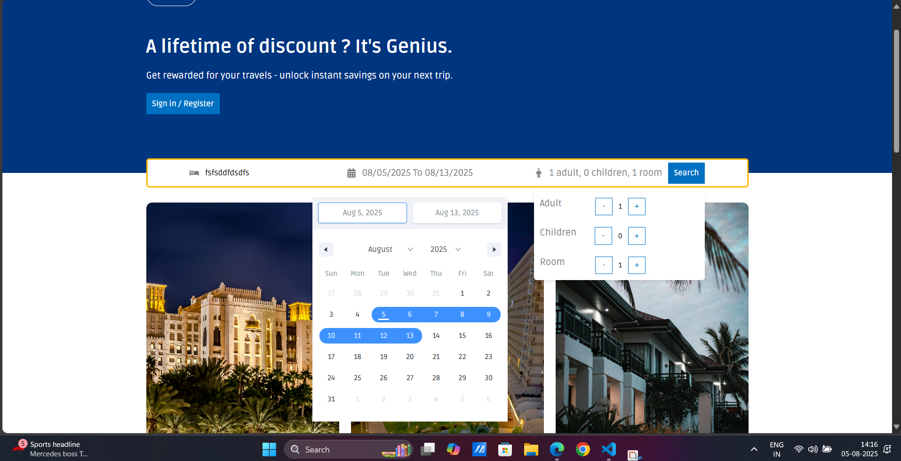
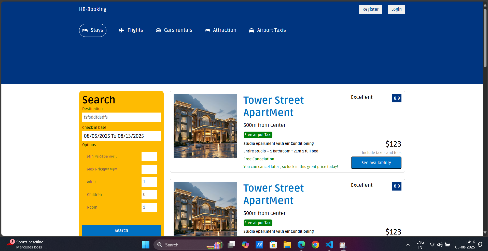
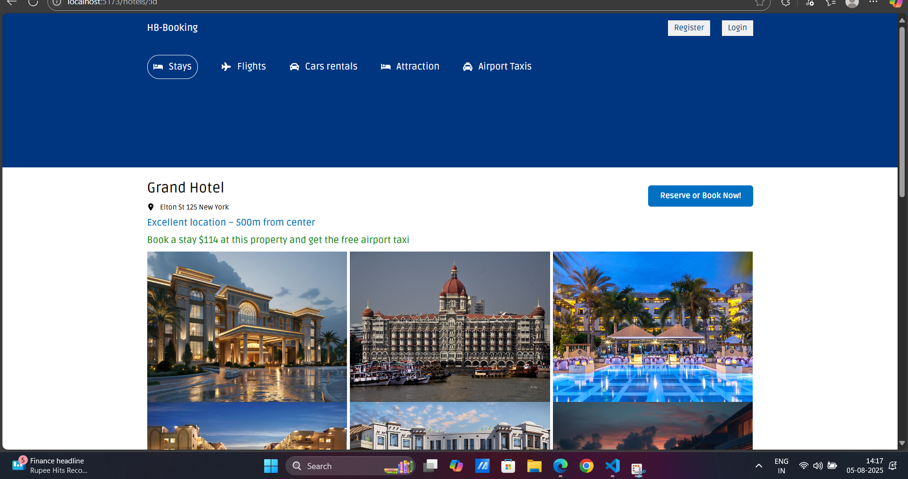
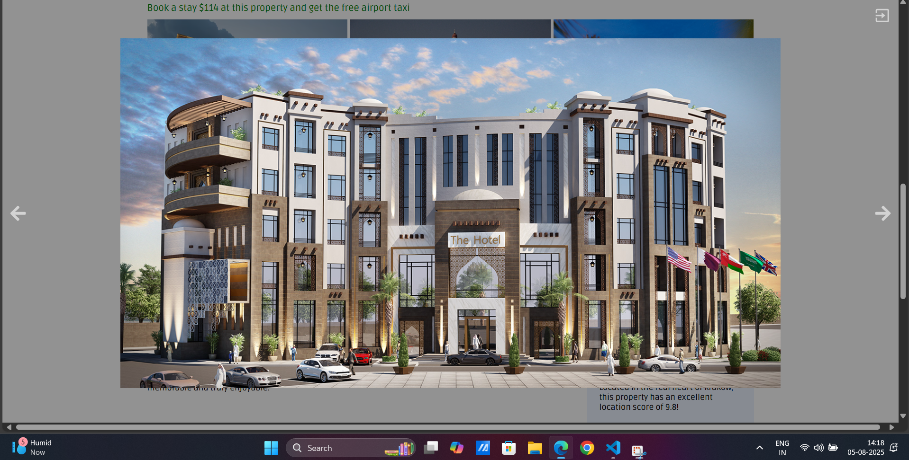

# Booking App

A modern hotel and property booking web application built with **React** and **Vite**.

---

## ✨ Features

- **Property Search:** Search for hotels and properties by destination, date, and guest options.
- **Property List:** Browse a list of property types (hotels, apartments, resorts, etc.) with images.
- **Hotel Details:** View detailed information, photo gallery, and booking options for each hotel.
- **Responsive Design:** Fully responsive layout for desktop and mobile.
- **Date Picker:** Select check-in and check-out dates with an interactive calendar.
- **Guest Options:** Choose number of adults, children, and rooms.
- **Booking Highlight:** See special offers and price highlights.
- **Reusable Components:** Modular structure with Header, Footer, PropertyList, Featured, MailList, and more.
- **Image Gallery:** Clickable hotel images with slider navigation.
- **Modern UI:** Clean, attractive interface with custom CSS and React Icons.

---

## 🏗️ Project Structure

```
Booking-App/
├── public/
│   └── vite.svg
├── src/
│   ├── assets/
│   │   ├── PropertyImg/
│   │   │   ├── 1.avif
│   │   │   ├── 2.jpg
│   │   │   ├── 3.jpg
│   │   │   ├── 4.jpg
│   │   │   ├── 5.jpg
│   │   │   ├── 6.jpg
│   │   │   ├── 7.jpg
│   │   │   └── 8.jpg
│   │   └── screenshots/
│   │       ├── 1.png
│   │       ├── 2.png
│   │       ├── 3.png
│   │       ├── 4.png
│   │       └── 5.png
│   ├── components/
│   │   ├── Footer/
│   │   ├── Header/
│   │   ├── MailList/
│   │   ├── Navbar/
│   │   ├── PropertyList/
│   │   └── featured/
│   ├── pages/
│   │   ├── Home/
│   │   ├── Hotel/
│   │   └── List/
│   ├── App.jsx
│   ├── main.jsx
│   └── index.css
├── index.html
├── package.json
└── vite.config.js
```

---

## 📸 Screenshots

### Home Page






### date and details



### Property List



### Hotel Details



### image Slider



---

## 🚀 Getting Started

1. **Install dependencies:**
   ```sh
   npm install
   ```

2. **Run the development server:**
   ```sh
   npm run dev
   ```

3. **Build for production:**
   ```sh
   npm run build
   ```

4. **Preview the production build:**
   ```sh
   npm run preview
   ```

---

## 🛠️ Main Components

- **Header:** Search bar, date picker, guest/room selection.
- **PropertyList:** Shows property types with images.
- **Featured:** Highlights featured hotels/properties.
- **Hotel:** Detailed hotel info, gallery, and booking.
- **Footer:** App footer with links and copyright.

---

## 📦 Dependencies

- [React](https://react.dev/)
- [Vite](https://vitejs.dev/)
- [react-router-dom](https://reactrouter.com/)
- [react-date-range](https://github.com/hypeserver/react-date-range)
- [react-icons](https://react-icons.github.io/react-icons/)

---

## 📄 License

This project is for educational/demo purposes only.

---